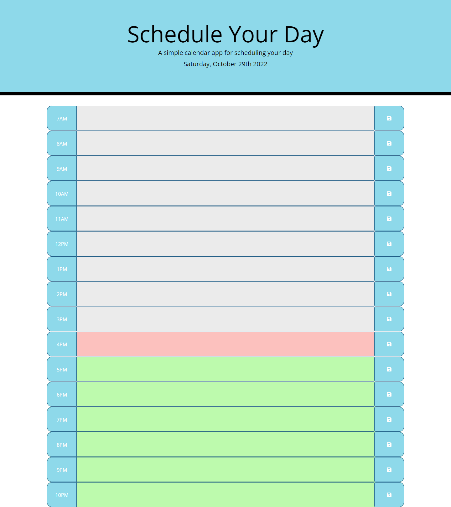

# Schedule-Your-Day

## Table of Contents

* [Description](#description)
* [Usage](#usage)
* [References](#References)
* [Credits](#credits)
* [License](#license)

## Description

Schedule Your Day website is a simple calendar application that allows a user to save events for each hour(7AM-10PM) of the day so user can manage his time effectively. Used [Moment.js](https://momentjs.com/) library to work with date and time.

     
## Usage

* Navigate to [Schedule-Your-Day](https://alkidavaci.github.io/Schedule-Your-Day/) to view the web page 
* [Schedule-Your-Day](https://github.com/alkidavaci/Schedule-Your-Day.git) in GitHub.

## References
1. JAVASCRIPT&JQUERY, Jon Duckett
2. [JQUERY](https://api.jquery.com/)
3. [Moment-js](https://momentjs.com/)

## License

